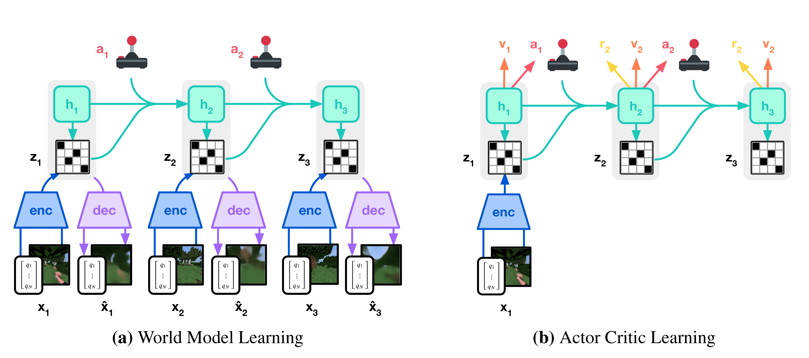

# Learning World Models with DreamerV3

## Context

For anyone landing on this repository, hi, I'm Guille. I'm a Data Scientist and I've spent most of my career building **Recommender Systems**. However, lately I've been interested in **robotics**, **self-driving cars** and what people call **physical AI**. My belief is that as AI gets more capable, the next frontier is to make it act in the real world, **physically**.

<i>"I want AI to do my laundry and dishes so that I can do art and writing, not for AI to do my art and writing so that I can do my laundry and dishes."</i> (<a href="https://x.com/AuthorJMac/status/1773679197631701238">Joanna Maciejewska</a>)

The problem is that I have no experience in those fields (I have never used Reinforcement Learning, for example), and I have no idea how to get started. 

To kick things off, I have read a bunch of blogposts, YouTube videos, and papers (check the [References](#references) section), and one that caught my attention was [Mastering Diverse Domains through World Models](https://arxiv.org/abs/2301.04104). This paper describes `DreamerV3`, a world model agent that learns to act in a variety of environments by first learning a model of how the world behaves.

This repo is me trying to fully understand `DreamerV3`. It is a study project, certainly not state-of-the-art research. I want to learn how world models actually work by getting my hands dirty with one, and, hopefully, have fun doing it!

## Why DreamerV3

Everywhere I look in robotics and autonomous driving, the same idea shows up: instead of learning to act directly from raw experience, **the agent first learns a model of how its world behaves**, and then uses that model to **train itself**. That is essentially a "world model".

`DreamerV3` is a great place to start. It is widely considered the canonical world model agent: it compresses what it sees into a compact latent state (a small summary of the situation), learns to predict how that state evolves when it acts, and trains its policy inside those predictions, on imagined futures. The agent basically learns from its own "dreams". 

One of the main achievements of this model is that it was the first agent that collected diamonds in Minecraft without any human data (I have never played Minecraft, but I found it funny that the top minds in AI use it as a benchmark).

*From the paper: the world model on the left, the actor critic that learns inside it on the right.*

I chose it for practical reasons too:

- It trains on a single GPU. I have none, but I can rent one from some cloud provider for a few dollars an hour.
- There are solid PyTorch implementations, so I do not need to rewrite everything myself.
- The benchmarks are public, so I can compare my curves against the published ones.

## My plan

1. Read the paper and the code. I will use [r2dreamer](https://github.com/NM512/r2dreamer), the official codebase of the R2-Dreamer paper. The goal is to understand the RSSM (the model at the heart of Dreamer).
2. Smoke test with tiny runs on free GPUs (e.g., Google Colab or Kaggle) to check the whole pipeline works.
3. Reproduce the published learning curves on DeepMind Control and Crafter. Everyone says this is the long and painful part.
4. Ablation (thanks Claude for the suggestion): change exactly one component of the world model, run several seeds, and compare against my reproduction with confidence intervals. I will choose the component once I understand the model well enough to have a real hypothesis about it.
5. If I think my learnings are worth sharing, I'll write a post (Medium or Substack) with the results, failures included.

## Final thoughts

World models sit behind a lot of the current work in robotics and autonomous driving, and I think this domain is about to explode, so they are worth understanding, whether I end up working on them or not. I also suspect that my Recommender Systems background (e.g., sequence models, embeddings) transfers better than it looks, and this project is a good way to test that.

## How to follow along

I will update this repo as I go with what I learned, what worked and what did not. The log below is the diary of the project.

---

## Log

### 5 July 2026

Created the repo and wrote the plan. Next step: read the paper and understand the model. I will also read the code of `r2dreamer` to see how it implements the model. I will try to write a summary of the paper and the code in this repo, so that both me and Claude (I will be using it as a coding assistant) can refer back to it later.

---

## References

Some of the material that got me started, in case it is useful for someone else:

Videos:

- [Yann LeCun's $1B Bet Against LLMs, Part 1](https://www.youtube.com/watch?v=kYkIdXwW2AE&t=1738s) and [Part 2](https://www.youtube.com/watch?v=v_jDvpEGTIg&t=150s), by Welch Labs. On why LeCun thinks the next step for AI is world models, not bigger LLMs.
- [Robotics' End Game: Nvidia's Jim Fan](https://www.youtube.com/watch?v=3Y8aq_ofEVs), by Sequoia Capital. On where robotics is going and the role of simulation and foundation models.

Blogposts:

- [World Models](https://worldmodels.github.io/), by Ha and Schmidhuber (2018). The interactive article that made the term popular. An agent learns to drive and to play Doom inside its own dream.
- [World Models](https://rohitbandaru.github.io/blog/World-Models/), by Rohit Bandaru. A long technical tour of world model architectures, including the RSSM used by Dreamer, and newer ones like JEPA, Genie and Cosmos.
- [Introducing GAIA-1](https://wayve.ai/thinking/introducing-gaia1/), by Wayve. A generative world model for self-driving, and a good example of these ideas applied in industry.

Papers:

- [Mastering Diverse Domains through World Models](https://arxiv.org/abs/2301.04104), by Hafner et al. The DreamerV3 paper this whole repo is about. The author's [project page](https://danijar.com/project/dreamerv3/) has the uncut videos of the Minecraft diamond runs.
- [R2-Dreamer: Redundancy-Reduced World Models without Decoders or Augmentation](https://openreview.net/forum?id=Je2QqXrcQq), by Morihira et al. (ICLR 2026). The paper behind the `r2dreamer` codebase I am using for my experiments.
