# How DreamerV3 works

DreamerV3 is a model-based reinforcement learning agent. It learns a compact model of the environment from real experience. It then uses that model to generate imagined trajectories and train its behavior.

The name comes from this second step. Most of the actor and critic learning happens inside the learned model, as if the agent were learning from dreams.

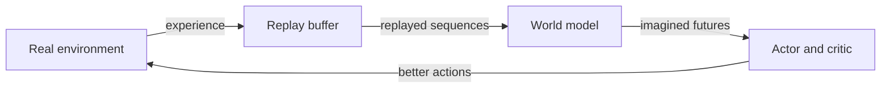

## The 3 learned components

| Component | Question it answers | What it learns |
|:---:|:---:|:---:|
| World model | What could happen next? | A compact state, its dynamics, rewards, and episode endings |
| Actor | What should I do? | A distribution over actions |
| Critic | How good is this state? | A distribution over future returns |

The three components have different parameters and different losses. They improve concurrently, but they are not one neural network trained with one shared objective.

The figure below shows the same split in the paper. The left side trains the World Model from real sequences. The right side trains the actor and critic from imagined sequences.


## 1. The World Model

The World Model is a Recurrent State-Space Model (RSSM). It does not try to copy every detail of the environment. It tries to keep the information needed to predict and act.

Its state at time $t$ is:

```math
s_t = (h_t, z_t)
```

| Part | Meaning | How it is obtained |
|:---:|---|:---:|
| $h_t$ | Deterministic recurrent state | Updated from the previous state and action |
| $z_t$ | Stochastic categorical state | Sampled from a prior or posterior distribution |

It is useful to think of $h_t$ as recurrent context and $z_t$ as the uncertain part of the current state. Calling them memory and perception is a reasonable first approximation, but the real model can distribute information across both.

The stochastic state is a vector of categorical variables. The model produces one probability distribution per row, samples one class from each row, and flattens the resulting one-hot vectors.

### One RSSM step

The recurrent state advances before the current observation is used:

```math
h_t = f_\phi(h_{t-1}, z_{t-1}, a_{t-1})
```

The model can then produce two distributions for $z_t$:

```math
\text{prior:}\quad p_\phi(z_t \mid h_t)
```

```math
\text{posterior:}\quad q_\phi(z_t \mid h_t, x_t)
```

The prior predicts what could be true before seeing the current observation. The posterior uses the observation to infer what is more likely to be true.

This is a diagram of one RSSM step:

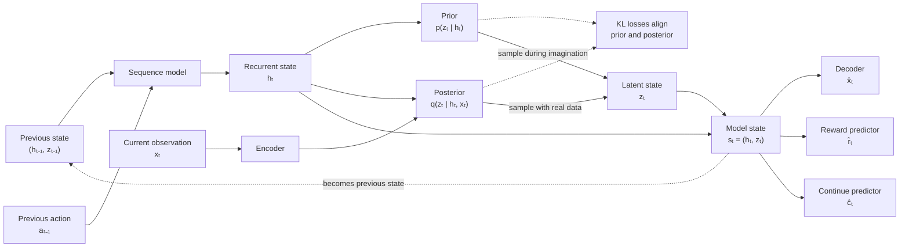

### A simple example

I created a very simple game to illustrate this guide:

1. The agent sees and collects a key, that can be either blue or red.
2. The key disappears.
3. The agent enters another room.
4. The room contains a red door and a blue door in random positions.
5. The agent receives a reward for opening the right door (either blue or red, depending on the key collected in step 1).

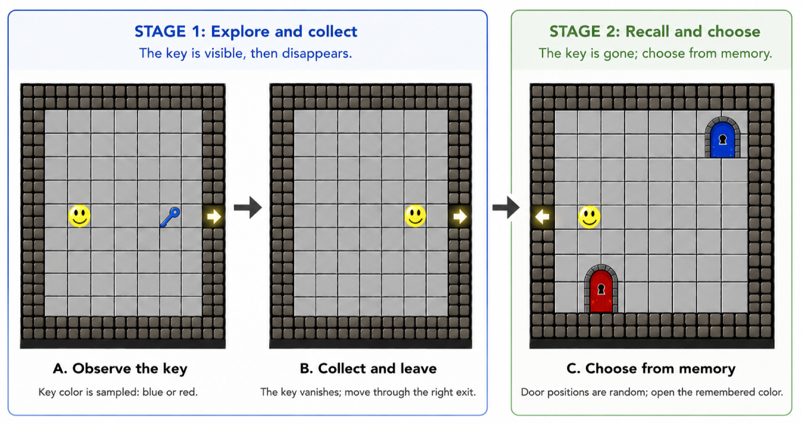

The agent needs the previous context to remember the key color. It also needs the current frame to locate the matching door.

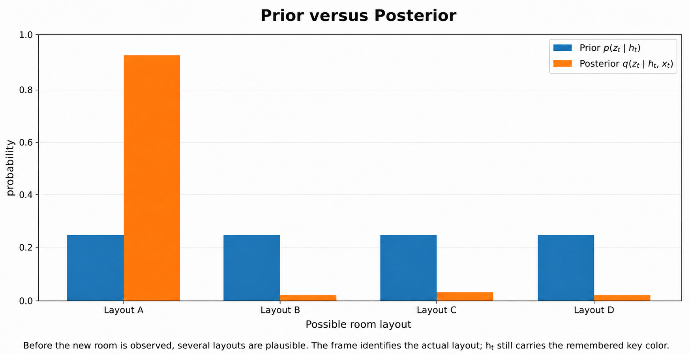


| Distribution | Information available | Role in the example |
|:---:|:---:|:---:|
| $p_\phi(z_t \mid h_t)$ | Recurrent context | Remembers the blue key but is uncertain about the layout |
| $q_\phi(z_t \mid h_t, x_t)$ | Recurrent context and current frame | Combines the blue key with the visible door positions |

### Why both distributions are needed

During real interaction or replay, the current observation exists. Dreamer can sample from the posterior:

```math
z_t \sim q_\phi(z_t \mid h_t, x_t)
```

During imagination, no future observation exists. Dreamer must sample from the prior:

```math
z_t \sim p_\phi(z_t \mid h_t)
```

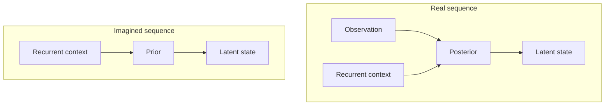

Training brings the prior and posterior close together. The posterior teaches the prior to predict latent states that agree with real observations. This is what makes useful open-loop imagination possible.

### What comes out of a model state

Once $s_t = (h_t, z_t)$ is available, several prediction heads use it:

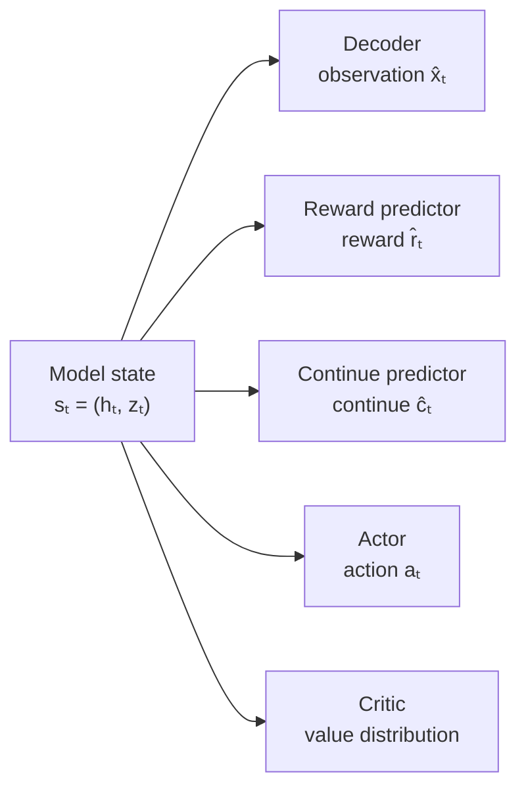

The decoder matters during training because reconstructing observations forces the latent state to contain useful information.

## 2. Learning the world from real experience

The actor interacts with the environment and stores transitions in a replay buffer:

```math
(x_t, a_t, r_t, c_t)
```

Here $c_t$ says whether the episode continues. The World Model trains on sequences sampled from this buffer.

Its loss has three main parts:

```math
\mathcal{L}_{\text{world}}
=
\mathcal{L}_{\text{pred}}
+
\mathcal{L}_{\text{dyn}}
+
0.1\mathcal{L}_{\text{rep}}
```

| Loss | What it trains |
|:---:|:---:|
| Prediction loss | Reconstruct the observation and predict reward and continuation |
| Dynamics loss | Make the prior predict the posterior while treating the posterior as a fixed target |
| Representation loss | Make the posterior easier for the prior to predict while treating the prior as a fixed target |

## 3. Learning behavior in imagination

After a world-model update, Dreamer starts from latent states inferred from replay. It then freezes the world-model parameters and creates imagined trajectories.

For one imagined transition:

1. The actor samples $a_t \sim \pi_\theta(a_t \mid s_t)$.
2. The sequence model advances $h_{t+1}$.
3. The prior samples $z_{t+1}$.
4. The reward and continue heads predict $\hat r_t$ and $\hat c_t$.
5. The actor and critic process the new model state.

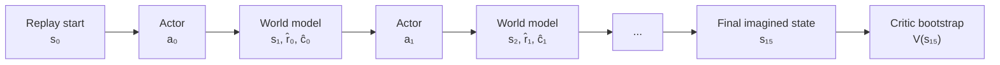

The standard imagination horizon contains 16 states and 15 transitions. This is often described as a 15-step imagined rollout.

### Return targets

The critic needs targets that include rewards beyond the short imagined horizon. Dreamer uses bootstrapped $\lambda$-returns:

```math
R_t^\lambda
=
\hat r_t
+
\gamma \hat c_t
\left[
(1-\lambda)V_\psi(s_{t+1})
+
\lambda R_{t+1}^\lambda
\right]
```

At the end of the imagined trajectory, the critic provides the bootstrap value:

```math
R_H^\lambda = V_\psi(s_H)
```

The imagined trajectory is generated forward. The return targets are then calculated backward.

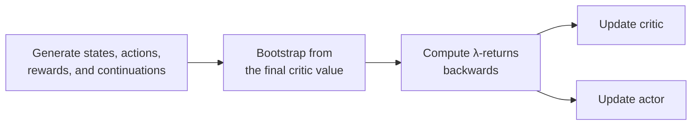

### Critic update

The critic predicts a distribution over future returns, not only one scalar. Its expected value is written as $V_\psi(s_t)$.

The critic is trained so that its predicted return distribution matches the $\lambda$-return target. In plain language, it learns what each imagined state is worth under the current actor.

### Actor update

The actor compares the imagined return with the critic baseline:

```math
A_t = R_t^\lambda - V_\psi(s_t)
```

A positive advantage means that the sampled action did better than expected. A negative advantage means that it did worse than expected.

## 4. The complete training loop

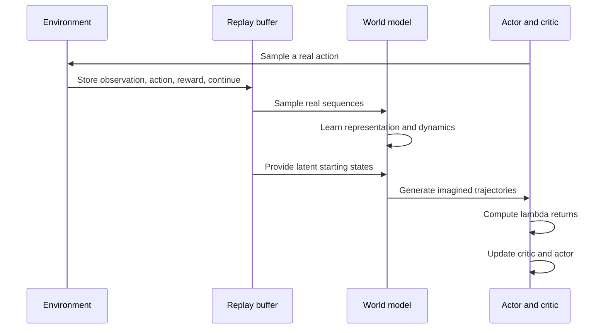

At the beginning, every component is poor. The actor behaves almost randomly, the critic has weak value estimates, and the World Model predicts badly. The loop can still start because real interaction supplies grounded data.

As training progresses:

1. A better World Model produces more useful imagined trajectories.
2. A better critic gives more useful learning signals.
3. A better actor collects more relevant real experience.

## 5. Acting after training

Dreamer does not normally plan with a fresh imagined rollout before every real action.

At each environment step:

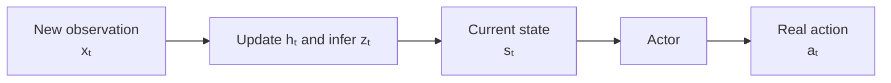

The actor already learned from imagination during training. At inference time, choosing an action is a direct forward pass from the current latent state.

The critic is not needed to select the action. The decoder is not needed either.

## Why DreamerV3 is robust across different tasks

The main idea existed before DreamerV3. Much of the third version is about making it work with one configuration across very different environments.

| Technique | Purpose |
|:---:|:---:|
| Symlog transforms | Compress large positive and negative values while keeping small values almost unchanged |
| Two-hot reward and value prediction | Predict continuous targets with categorical distributions whose gradients do not grow with the target scale |
| KL balancing and free bits | Keep the prior and posterior compatible without collapsing the representation |
| One percent uniform mixture | Prevent categorical distributions from becoming completely deterministic |
| Percentile return normalization | Keep actor updates on a similar scale across tasks |
| Entropy regularization | Preserve exploration |

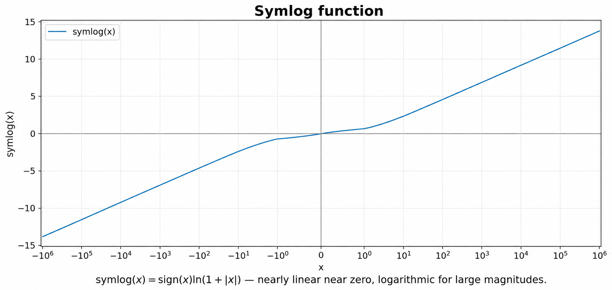

## Common misconceptions

| Misconception | More precise description |
|:---:|:---:|
| The World Model predicts future pixels so the actor can inspect them | The actor and critic train on compact latent states. Pixel reconstruction is a world-model training signal |
| The critic chooses the best action | The actor chooses actions. The critic estimates returns |
| Dreamer plans online before every action | Imagination is mainly a training tool. Real action selection uses the actor directly |
| The posterior is used during imagination | Imagined future observations do not exist, so imagination uses the prior |
| The actor and critic losses train the World Model | The world-model parameters stay frozen during imagined behavior learning |
| $h_t$ is only memory and $z_t$ is only perception | This is a useful mnemonic, but information can be distributed across both |

## Final mental model

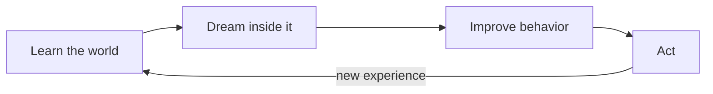

The World Model is a learned latent simulator grounded in real experience. The actor practices inside that simulator. The critic estimates how valuable the imagined states are. Once trained, the actor reacts directly from the current latent state.

## Sources

This explanation is based on my study notes and the following primary sources:

- [Mastering diverse control tasks through World Models](https://www.nature.com/articles/s41586-025-08744-2), the published DreamerV3 paper.
- [Mastering Diverse Domains through World Models](https://arxiv.org/abs/2301.04104), the arXiv version.
- [Danijar Hafner's DreamerV3 JAX repository](https://github.com/danijar/dreamerv3), which is not the experimental codebase used in this study.
