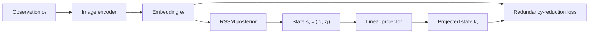
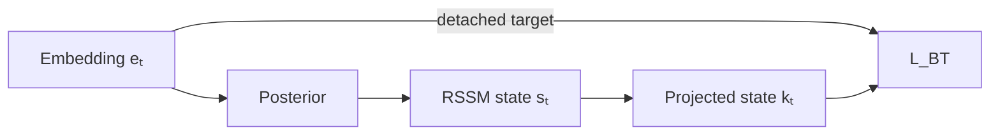
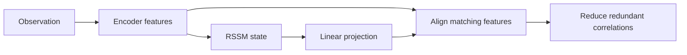

# How R2-Dreamer works

R2-Dreamer keeps the main DreamerV3 machinery but changes how the World Model learns its visual representation.

This guide focuses on that difference. The [DreamerV3 guide](how-dreamerv3-works.md) already explains the shared RSSM, prior and posterior, latent imagination, actor, critic, and inference loop.

In short, DreamerV3 trains its latent state by reconstructing observations. **R2-Dreamer removes the image decoder and replaces reconstruction with a redundancy-reduction objective in feature space**.

## How this relates to the study

DreamerV3 is the conceptual foundation for this project. R2-Dreamer is the comparison method, and its authors' [`NM512/r2dreamer`](https://github.com/NM512/r2dreamer) PyTorch codebase is used for the experiments.

That codebase provides:

- a DreamerV3 baseline selected with `model.rep_loss=dreamer`;
- R2-Dreamer selected with `model.rep_loss=r2dreamer`.

The first configuration is the R2-Dreamer authors' PyTorch reproduction of DreamerV3. It is not the original DreamerV3 implementation. The two configurations provide a controlled comparison inside one codebase, but any results must be attributed to the implementation that produced them.

## What stays the same

R2-Dreamer retains the parts of DreamerV3 described in the main [guide](how-dreamerv3-works.md):

- an image encoder;
- an RSSM with deterministic state \(h_t\) and stochastic state \(z_t\);
- prior and posterior distributions;
- reward and continuation predictors;
- latent imagination;
- the actor and critic;
- the real-environment inference loop.

The actor-critic algorithm and RSSM dynamics are unchanged. The modification is concentrated in the visual representation-learning signal used to train the World Model.

|               Component               | DreamerV3 | R2-Dreamer |
| :-----------------------------------: | :-------: | :--------: |
|        Image encoder and RSSM         |    Yes    |    Yes     |
|  Reward and continuation predictors   |    Yes    |    Yes     |
| Actor, critic, and latent imagination |    Yes    |    Yes     |
|             Image decoder             |  **Yes**  |   **No**   |
|       Pixel reconstruction loss       |  **Yes**  |   **No**   |
|           Linear projector            |    No     |  **Yes**   |
|       Redundancy-reduction loss       |    No     |  **Yes**   |
|      Data augmentation required       |    No     |   **No**   |

## The problem R2-Dreamer addresses

An image contains much more information than an agent normally needs for control.

Consider a reaching task where the agent must move an arm toward a tiny target. Most pixels may describe the background, floor, arm, lighting, and empty space. Only a few pixels describe the target.

DreamerV3 asks its latent state to reconstruct the complete observation. Large visual regions can therefore contribute much more reconstruction error than a small task-critical object. The R2-Dreamer paper argues that this can:

1. spend latent capacity on details that do not help control;
2. spend computation on decoding every output pixel;
3. give small but important features a comparatively weak learning signal.

Removing the decoder alone is not enough. Without a replacement objective, a representation can collapse by mapping different observations to nearly the same features:

```text
observation A ─┐
observation B ─┼──> [0.2, 0.2, 0.2, ...]
observation C ─┘
```

Some decoder-free methods prevent collapse by comparing augmented versions of an image. However, a random shift could move a tiny object out of view, and color changes could remove task-relevant information.

R2-Dreamer instead prevents collapse through an internal redundancy-reduction objective. It does not reconstruct pixels or require image augmentation.

## The representation-learning change

DreamerV3 decodes the model state into an observation:

$$
\hat o_t \sim p_\phi(\hat o_t \mid s_t)
$$

Its reconstruction loss asks the state to preserve enough information to reproduce the pixels:

$$
\mathcal{L}_{\text{recon}}(t)
=
-\log p_\phi(o_t \mid s_t)
$$

R2-Dreamer removes this decoder. It adds a lightweight linear projector that maps the model state into the same feature space as the encoded observation:

$$
e_t = \operatorname{enc}_\phi(o_t)
$$

$$
k_t = \operatorname{proj}_\phi(s_t)
$$

It then compares:

- \(e_t\), the features extracted from the current observation;
- \(k_t\), the features predicted from the complete RSSM state.



The objective changes the question asked of the latent state:

|              DreamerV3              | R2-Dreamer                                                                         |
| :---------------------------------: | ---------------------------------------------------------------------------------- |
| Can the state recreate every pixel? | Does the state retain the encoded information without representing it redundantly? |

## The redundancy-reduction objective

R2-Dreamer adapts the Barlow Twins objective.

For a batch containing \(B\) sequences of length \(T\), the projected states and observation embeddings are reshaped so that all \(B \times T\) time steps become samples:

$$
K \in \mathbb{R}^{BT \times D},
\qquad
E \in \mathbb{R}^{BT \times D}
$$

Each feature dimension is standardized across those samples. The model then computes a cross-correlation matrix:

$$
C_{ij}
=
\frac{1}{BT}
\sum_{n=1}^{BT}
\tilde K_{n,i}\tilde E_{n,j}
$$

Here, \(C\_{ij}\) measures how strongly dimension \(i\) of the projected state varies with dimension \(j\) of the observation embedding.

The loss is:

$$
\mathcal{L}_{\text{BT}}
=
\underbrace{
\sum_i (1-C_{ii})^2
}_{\text{alignment}}
+
\alpha
\underbrace{
\sum_{i\ne j} C_{ij}^2
}_{\text{redundancy reduction}}
$$

It has two complementary jobs.

### Align matching dimensions

The diagonal entries should approach one:

$$
C_{ii} \rightarrow 1
$$

This encourages each dimension of the projected state to agree with the corresponding dimension of the observation embedding. In the paper this is called the invariance term.

### Reduce redundancy

The off-diagonal entries should approach zero:

$$
C_{ij} \rightarrow 0
\qquad \text{for } i \ne j
$$

Penalizing correlations between different dimensions encourages them to represent different factors instead of repeating the same signal.

The combined target resembles an identity matrix:

$$
C
\approx
\begin{bmatrix}
1 & 0 & 0 \\
0 & 1 & 0 \\
0 & 0 & 1
\end{bmatrix}
$$

The diagonal says: "preserve shared information". The off-diagonal says: "do not preserve it redundantly".

## Where the two views come from

Standard Barlow Twins normally compares two augmented versions of the same image. R2-Dreamer uses a pair already available inside the World Model:

|  View   |                         Meaning                          |
| :-----: | :------------------------------------------------------: |
| \(e_t\) | Features extracted directly from the current observation |
| \(k_t\) |     Features predicted from the complete RSSM state      |

The RSSM state combines recurrent context, previous actions, and information inferred from the current observation. R2-Dreamer therefore aligns **what the image says now** with **what the World Model state knows now**. No artificial image transformation is required.

## The stop-gradient detail

The implementation detaches the observation embedding in the direct target branch:

$$
\operatorname{sg}(e_t)
$$

A simplified version is:

```python
state = torch.cat([h, z], dim=-1)
k = projector(state)

k = k.reshape(batch_size * sequence_length, feature_dim)
e = e.detach().reshape(batch_size * sequence_length, feature_dim)
```

This does not freeze the image encoder. The encoder output also enters the posterior, so gradients can still reach the encoder through:

$$
e_t
\rightarrow
q_\phi(z_t \mid h_t,e_t)
\rightarrow
s_t
\rightarrow
k_t
\rightarrow
\mathcal{L}_{\text{BT}}
$$



The detached branch supplies a stable target while the posterior and RSSM path continue to train the representation.

## The resulting World Model loss

DreamerV3 combines observation reconstruction, reward and continuation prediction, and the prior-posterior KL losses:

$$
\mathcal{L}_{\text{DreamerV3}}
=
\sum_t
\left[
\mathcal{L}_{\text{recon}}(t)
+
\mathcal{L}_{\text{pred}}(t)
+
\beta_{\text{dyn}}\mathcal{L}_{\text{dyn}}(t)
+
\beta_{\text{rep}}\mathcal{L}_{\text{rep}}(t)
\right]
$$

R2-Dreamer replaces only the reconstruction component:

$$
\mathcal{L}_{\text{R2}}
=
\beta_{\text{BT}}\mathcal{L}_{\text{BT}}
+
\sum_t
\left[
\mathcal{L}_{\text{pred}}(t)
+
\beta_{\text{dyn}}\mathcal{L}_{\text{dyn}}(t)
+
\beta_{\text{rep}}\mathcal{L}_{\text{rep}}(t)
\right]
$$

The paper uses:

|                  Hyperparameter                   |       Value        |
| :-----------------------------------------------: | :----------------: |
|       BT loss scale \(\beta\_{\text{BT}}\)        |        0.05        |
|           Off-diagonal scale \(\alpha\)           | \(5\times10^{-4}\) |
|    Dynamics-loss scale \(\beta\_{\text{dyn}}\)    |         1          |
| Representation-loss scale \(\beta\_{\text{rep}}\) |        0.1         |
|                 Batch size \(B\)                  |         16         |
|               Sequence length \(T\)               |         64         |

The reward and continuation predictors, KL balancing, free bits, and latent uniform mixture remain in place.

## Training and acting remain Dreamer-like

R2-Dreamer still trains its World Model from real sequences stored in replay. The image encoder, RSSM, prior, posterior, reward predictor, continuation predictor, and new projector learn from those sequences. Only the image decoder is removed.

Actor and critic training remains unchanged:

1. infer starting states from replay;
2. imagine futures through the RSSM prior;
3. predict rewards and continuation;
4. compute bootstrapped returns;
5. update the critic and actor.

Action selection also remains unchanged. The agent encodes the current observation, updates its RSSM state, and gives that state to the actor. Neither the removed decoder nor the R2-Dreamer projector is needed during inference.

For the full shared loop, see [How DreamerV3 works](how-dreamerv3-works.md).

## What the paper found

The reported results support a narrower claim than “R2-Dreamer always performs better.”

- **Standard DeepMind Control Suite:** R2-Dreamer was competitive across 20 visual-control tasks.
- **Meta-World:** it remained competitive across 50 individually trained manipulation tasks.
- **DMC-Subtle:** it showed its strongest aggregate gains when task-critical visual features were reduced to only a few pixels.

The authors also reported 4.4 hours for one million Walker Walk environment steps on one RTX 3080 Ti, compared with 7.0 hours for their PyTorch DreamerV3 reproduction. This is evidence that removing the decoder can reduce training cost under that setup, not a universal speed guarantee.

The paper's ablations provide three useful lessons:

1. Removing reconstruction without a replacement objective performed poorly.
2. Adding image augmentation to R2-Dreamer hurt several DMC-Subtle tasks.
3. Reducing the batch size from 16 to 8 did not substantially reduce aggregate performance.

The paper also used occlusion-based policy saliency on Reacher-subtle. R2-Dreamer's policy sensitivity was more concentrated around the small target. This is useful qualitative evidence, but it measures policy sensitivity rather than the information stored directly in the latent state.

## Common misconceptions

|                Misconception                |                     More precise description                     |
| :-----------------------------------------: | :--------------------------------------------------------------: |
| R2-Dreamer is a completely new architecture |      It retains DreamerV3's RSSM and actor-critic machinery      |
|     R2-Dreamer just removes the decoder     | It replaces reconstruction with a redundancy-reduction objective |
|            The encoder is frozen            |            Only the direct target branch is detached             |
|      It compares two augmented images       | It compares an observation embedding with a projected RSSM state |
| The projector predicts future observations  | It maps the current state into the current encoder feature space |
|        The projector is used to act         |              It is only a World Model training head              |
|   R2-Dreamer always outperforms DreamerV3   |          Its strongest reported gains are on DMC-Subtle          |

## Final mental model

DreamerV3 asks: "Can this state reconstruct what I saw?". R2-Dreamer asks: "Does this state preserve what the encoder saw, without representing the same information repeatedly?"



Everything after representation learning remains Dreamer-like: learn the World Model from real experience, train the actor and critic in imagined futures, and act directly from the latent state.

## Sources

- [**R2-Dreamer: Redundancy-Reduced World Models without Decoders or Augmentation**](https://openreview.net/forum?id=Je2QqXrcQq), Morihira et al., ICLR 2026.
- [**Mastering Diverse Control Tasks through World Models**](https://www.nature.com/articles/s41586-025-08744-2), Hafner et al., the separate published DreamerV3 paper.
- The unified PyTorch implementation released at [NM512/r2dreamer](https://github.com/NM512/r2dreamer).
